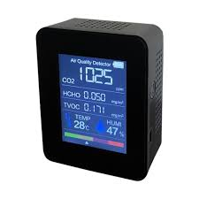

# AirQuality
Récupère la qualité de l’air extérieur en temps réel.

- This plugin is an add-on for the [A.V.A.T.A.R](https://avatar-home-automation.github.io/docs) framework.

## 🎯 Usage
Commandes :
- quel est la qualité de l’air extérieur 
- donne moi la qualité de l’air extérieur  

## Multi-room

The `AirQuality` plugin is fully multi-room.

## Multi-language

The `AirQuality` plugin relies solely on the system's available languages.

   <table style="border: none;">
  <tr>
    <td style="border: none;"></td>
    <td style="border: none;">
      <h1 style="margin: 0;color: brown;">AirQuality</h1>
      <h3 style="margin: 0;">Get air quality</h3>
    </td>
  </tr>
</table>
